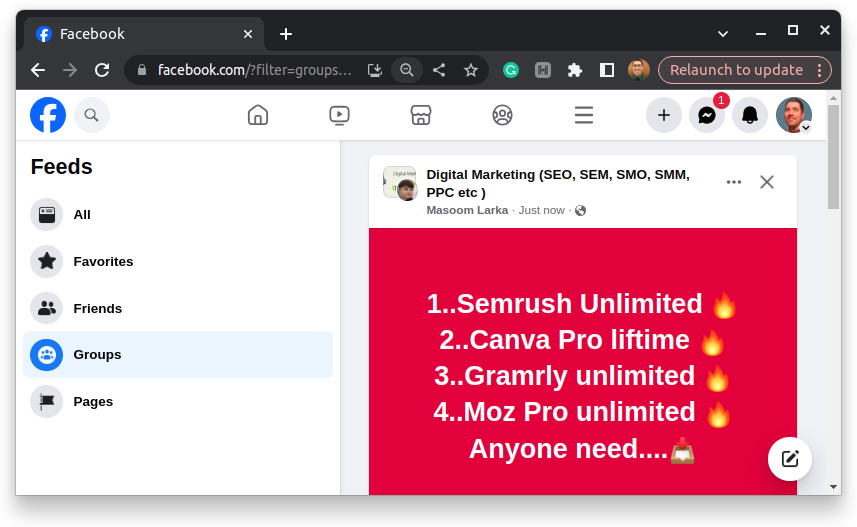
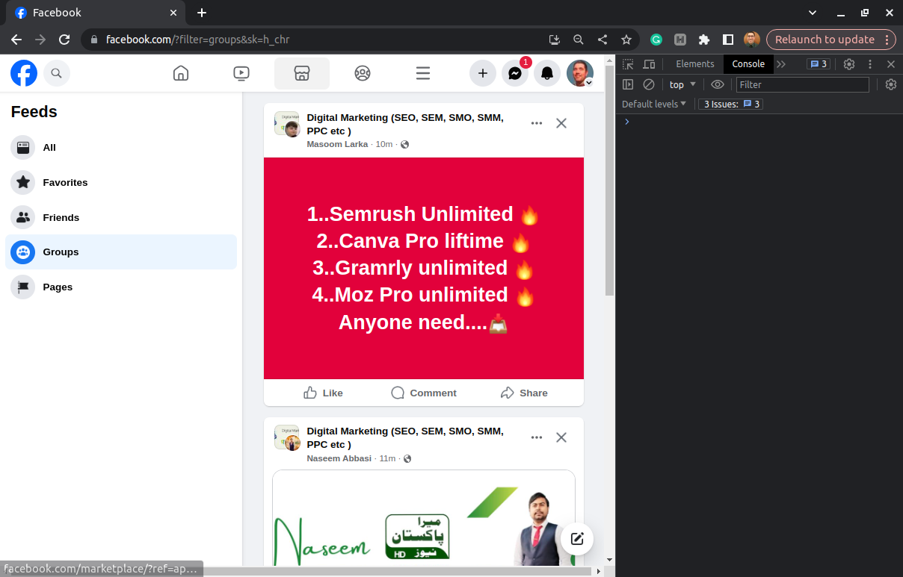
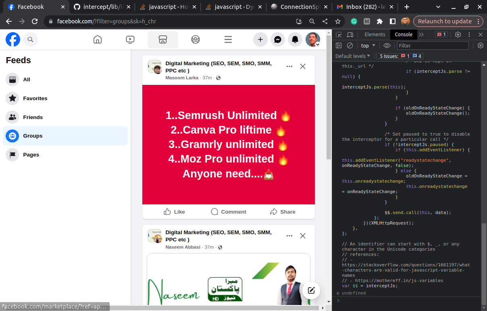
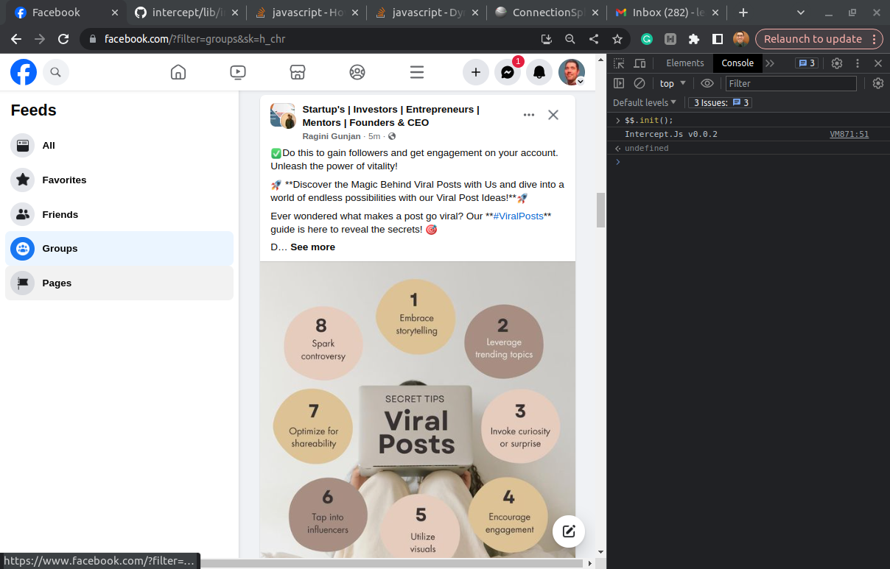
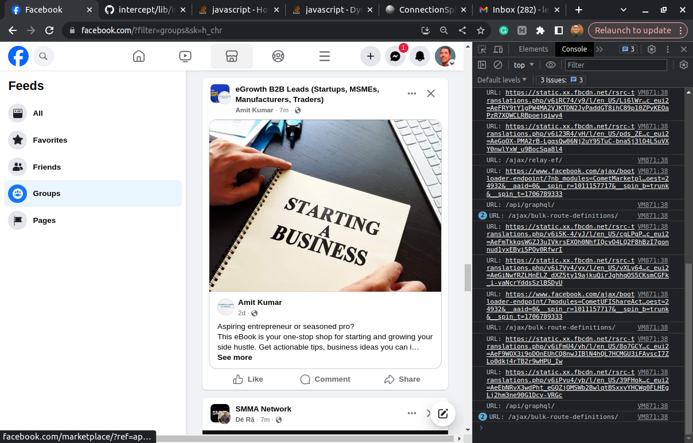
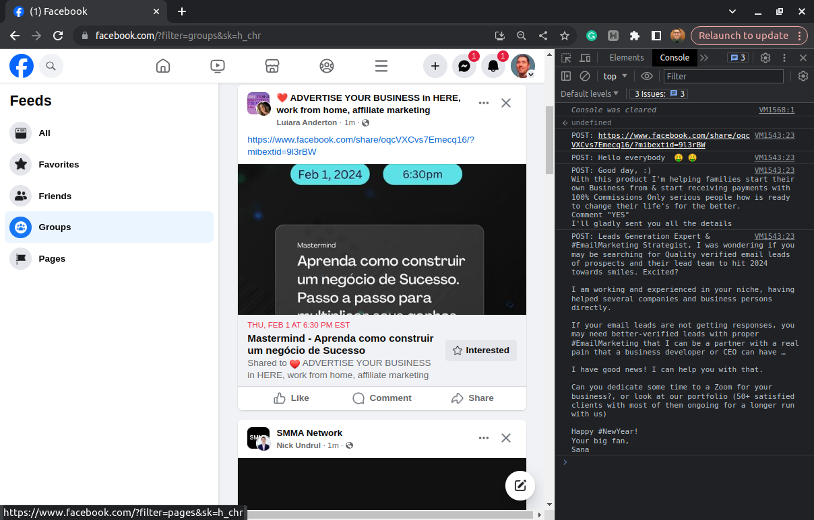
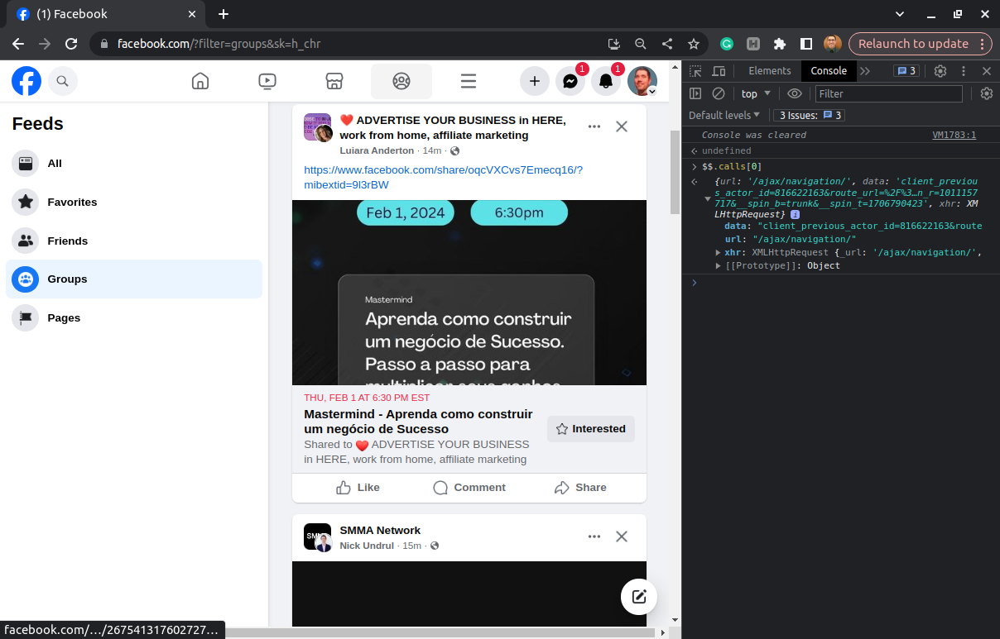

   

# intercept.js

JavaScript library for intercepting AJAX / XHR calls performed by a website in order to:

1. perform reverse engineering of communication between front-end and back-end; and 

2. perform data extraction (a.k.a scraping) of such a website.

**Outline:**

1. [Getting Started](#1-getting-started)
2. [Processing AJAX Responses](#2-processing-ajax-responses)
3. [Gathering Data](#3-gathering-data)
4. [Pause Interception](#4-pause-interception)
5. [Debug Mode](#5-debug-mode)
6. [Working with Selnium](#6-working-with-selenium)
7. [Disclaimer](#disclaimer)

## 1. Getting Started

1. Open a browser where you can access your Facebook profile.

2. Go to [this URL](https://www.facebook.com/?filter=groups&sk=h_chr) to see the latest posts in the Facebook groups where you are joined to:



3. Press CTRL+SHIFT+I to open the Developer Tools:



4. Inject **intercept.js** the the webpage.

In the console tab, paste [the source code of **intercept.js**](https://github.com/leandrosardi/intercept/blob/main/lib/intercept.js) and press ENTER.



5. Initialize **intercept.js**:

```javascript
$$.init();
```



6. Scroll down to load new posts, and see the URLs of the AJAX calls in the console.




## 2. Processing AJAX Responses

Initialize **intercept.js** with a custom parsing function.

**E.g.:** The code below extract the content of each post from the AJAX response.

```javascript
$$.init({
    parse: function(xhr) {
        var s = null; // complete response text 
        var ar = null; // array of lines in the response text
        var x = null; // line in the response text
        var t = null; // response text wrapped in array
        var j = null; // response json

        // get the content of all the posts
        if (xhr._url == '/api/graphql/') {
            s = xhr.responseText;
            ar = s.split("\n");
            for (let z = 0; z < ar.length; z++) {
                x = ar[z];
                // JSON is not a valid json, you must wrap it in array.
                t = '['+x+']';
                j = JSON.parse(t)[0];

                if (x.startsWith('{"label":"CometNewsFeed_viewerConnection$stream$CometNewsFeed_viewer_news_feed"')) {

                    let a = j.data.node.comet_sections.content.story.message;
                    if (a != null) {
                        console.log('POST: ' + a.text);
                    }
                }
            }
        } 
    }
});
```



Additioonally to logging the contents, you can store them into the `$$.data` array.

```javascript
console.log('POST: ' + a.text);
$$.push(a.text);
```

## 3. Gathering Data

Every time you call the `$$.push` metod you add an element into the array `$$.data`

```javascript
console.log($$.data.length);
// => 1
```

You can clean up both arrays: `$$.data` and `$$.calls` by calling the `$$.reset` method:

```javascript
$$.reset();
```


## 4. Pause Interception

You can pause interception:

```javascript
$$.pause();
```

You can resume interception:

```javascript
$$.play();
```

You can check if interception is running or not:

```javascript
$$._paused
// => true
```

## 5. Debug Mode

You can request **intercept.js** to store all the requests and their responses into an array.

```javascript
$$.debug(true);
```

You can also define the debugging mode when initialize:

```javascript
$$.init({
    debug: true,
    parse: function(xhr) {
        // ...
    }
});
```

Such a feature is useful for developers, when they are performing reverse engieering of a website.

```javascript
$$.calls.length
// => 64

$$.calls[0].url
// => '/ajax/navigation/'
```



You can check if **intercept.js** is running in debug mode or not:

```javascript
$$._debug
// => false
```

Such a feature is resourses consuming too, and it should keep disabled in production environment.

## 6. Working with Selenium

_pending to write_

## Disclaimer

Use this library at your own risk.

